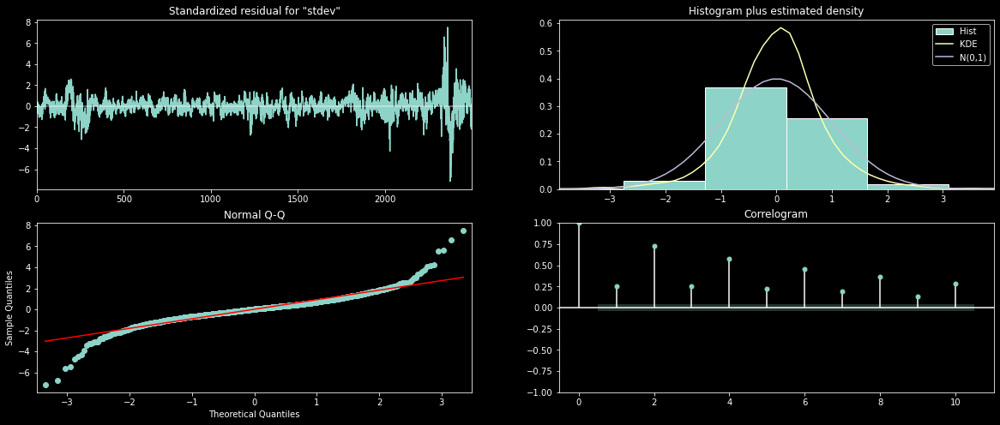
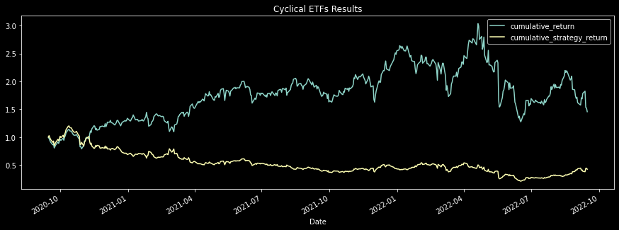
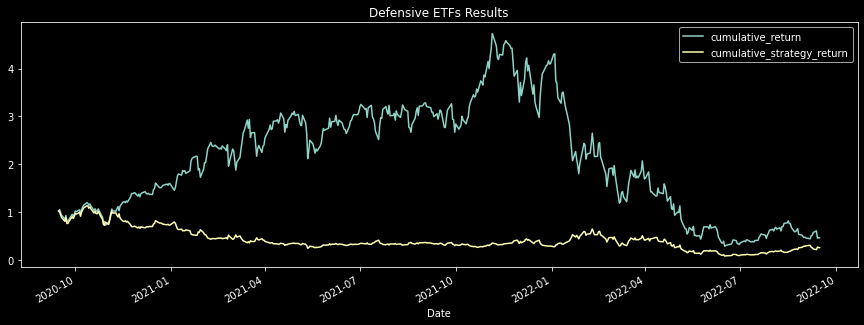

# Predicted Volatility: Applying Predicted Volatility to Determine Profitability of Cyclical and Defensive ETFs

## **Project Overview**

### *Package Requirements and Versions*
`pip install x` ; where 'x' is the package listed below:
* `python == 3.7.13+`
* `arch == 5.3.1`
* `cufflinks == 0.17.3`
* `json == 2.0.9`
* `matplotlib == 3.5.1`
* `numpy == 1.21.5`
* `pandas == 1.3.5+`
* `plotly == 5.10.0`
* `scikit-learn == 1.1.2`
* `scipy == 1.9.1`
* `seaborn == 0.12`
* `statsmodels == 0.13.2`

### *Files Navigation*
* `DATA`: Directory containing all original CSV files
* `PLOTS`: Directory containing all images of plots created in Jupyter Notebook
* `garch.ipynb`: Notebook containing GARCH model
* `varmax.ipynb`: Notebook containing VARMAX model
* `trading_algo.ipynb`: Notebook containing trading algorithm
* `main.py`: Script to run full VARMAX model and trading algorithm
* `varmax.py`: Script to run VARMAX model
* `trading.py`: Script to run trading algorithm

### *Purpose of Use*

Our team decided to investigate the effectiveness of predicting index volatity as a trading strategy and its profitability when trading cyclical and defensive securities (ETFs). 

The business question we hope to answer is: *is trading cyclical or defensive ETFs based on future volatility profitable? If so, which set of ETFs is more profitable?*

Our motivation for taking on this challenge is to find out if, based on historical price data, we could predict future volatility, use the predicted future volatility as a reference for our trading strategy, and then find out if cyclical or defensive ETFs were more profitable during the period of predicted volatility.

For reference, a **cyclical stock** is "a stock whose price is affected by macroeconomic or systematic changes in the overall economy. Cyclical stocks are known for following the cycles of an economy through expansion, peak, recession, and recovery. Most cyclical stocks involve companies that sell consumer discretionary items that consumers buy more during a booming economy but spend less on during a recession." [1]

A **defensive stock** is "a stock that provides consistent dividends and stable earnings regardless of the state of the overall stock market." [2] 

And one important thing to note is that "[c]yclical stocks are generally the opposite of defensive stocks. Cyclical stocks include discretionary companies, such as Starbucks or Nike, while defensive stocks are staples, such as Campbell Soup." [1]

When referring to ETFs, portfolio managers try to create uncorrelated returns with benchmark indices providing risk-adjusted returns for clients and investors.

We hope to answer our business question by using historical candlestick, volume, and volatility data for the S&P 500, and closing price data for five cyclical ETFs and five defensive ETFs. All of this data can be accessed through the Google Finance - Google Sheets API.

The specific ETFs analyzed:
* Cyclical:
  * ITB: iShares U.S. Home Construction ETF (Cboe BZX Exchange)
  * IYC: iShares US Consumer Discretionary ETF (NYSE Arca Exchange)
  * PEJ: Invesco Dynamic Leisure & Entertainment ETF (NYSE Arca Exchange)
  * VCR: Vanguard Consumer Discretionary Index Fund ETF (NYSE Arca Exchange)
  * XLY: Consumer Discretionary Select Sector SPDR Fund (NYSE Arca Exchange)
* Defensive:
  * IYK: iShares US Consumer Staples ETF (NYSE Arca Exchange)
  * KXI: iShares Global Consumer Staples ETF (NYSE Arca Exchange)
  * PBJ: Invesco Dynamic Food & Beverage ETF (NYSE Arca Exchange)
  * VDC: Vanguard Consumer Staples Index Fund ETF (NYSE Arca Exchange)
  * XLP: Consumer Staples Select Sector SPDR Fund (NYSE Arca Exchange)

The time periods analyzed include:
* S&P 500: October 5, 2010 - September 30, 2022
* Cyclical ETFs: September 27/28, 2010 - September 23, 2022
* Defensive ETFs: September 27/28, 2010 - September 23, 2022

--------------

## Data Pre-Processing/Gathering Steps (Cleaning and Manipulation)

Our team decided to use the Google Finance API to get the historical closing, candlestick, volume, and volatility data for the S&P 500 Index, and the historical closing prices of ten different ETFs. After connecting via API to Google Finance, we created files for the Index and each ETF by using Google Sheets and then exporting those as CSVs. The collection of CSVs can be found in the `DATA` directory. We exported as much historical data as was available, which ended up going back to late September 2010 through late September 2022. However, some of the data was eventually dropped in order to ensure all data sources lined up correctly. We used the tickers $ITB, $IYC, $PEJ, $VCR, $XLY, $IYK, $KXI, $PBJ, $VOC, and $XLP for the ETFs. All of these are on the NYSE Arca Exchange, except $ITB, which is on the Cboe BZX Exchange. This group of ten ETFs are a sample of five cyclical and five defensive ETFs that covers a range of both types.

In order to get the predicted volatility based on the S&P 500, we used both GARCH, a statistical model, and VARMAX, a machine learning model. 

First, we ran the GARCH model. [4, 7] To run this model, we added the S&P 500 data to a dataframe, and in addition to the closing prices we added columns with the calculated daily returns and the standard deviation (based on a rolling window of 5). Next, we used the Augmented Dickey-Fuller test to see if the data gathered was stationary. [3] Once it was confirmed the data was stationary, we were able to apply the `ACF` and `PACF` plots to find the appropriate `p,q`. After figuring out the `p,q` to use, we were able to run the GARCH model and forecast.

GARCH Summary Table

Next, we ran the VARMAX model. [5, 6] To run this model, we followed the same steps as above before we ran the GARCH model: added data to a dataframe, got the daily returns and the standard deviation with a rolling window of 5, found the `p,q` using an `ACF` plot, checked the stationarity of the daa, scaled the data using `MaxAbsScaler`, and tested the `p,q`. Once the data was manipulated, we created the VARMAX model and ran it.

## Visuals and Explanations

Below is a sample of plots that were created during the data cleanup, after running both models, and after running the trading algorithm. All plots can be found in the `PLOTS` directory.

GARCH Predicted Volatility

VARMAX Results

Cyclical ETFs Actual Returns vs. Strategy Returns

Defensive ETFs Actual Returns vs. Strategy Return

All plots not included here can be found in the `PLOTS` directory.

## Additional Explanations and Major Findings

Once both models ran, we continued the process of getting the predicted volatility with the VARMAX model. 

After the VARMAX model was created, we were able to create a new trading algorithm to determine whether or not cyclical or defensive ETFs should be bought or sold based on the VARMAX model's predicted volatility. This algorithm was also put into a function and is able to run via the script `main.py`.

First, we calculated the daily returns for each of the ETFs and concated the cyclical ETFs into one dataframe, and the defensive ETFs into another dataframe. Next, we calculated the sum of each day's returns and added a new column with the sums to each dataframe.

By calculating the predicted volatility and comparing it to the observed volatility, we added a signal column to the dataframe that indicated whether or not the ETFs on that day should be classified as "buy" or "sell."

Our primary finding after running the trading algorithm is that our model did not work as well as we hoped. Overall, the signal predictions of "buy" and "sell" resulted in strategy returns of 1.28% compared to actual returns of 0.49% for cyclical ETFs. Additionally, it resulted in strategy returns of 1.58% compared to actual returns of 1.67% for defensive ETFs.

## Challenges, Limitations, and Future Developments

The initial challenge was deciding which data to use for the analysis. We originally wanted to include more than one index to calculate the predicted volatility, but our time constraints limited that. It would have taken too long to run the models with more than one Index, therefore we decided to move forward with only one: the S&P 500. 

After initially running both models, it was clear that there could have been additional testing done in order to get a more satisfactory error number. In the tests that were performed, there were also conflicting findings when running tests for the best `p,q` values for our VARMAX model. For example, this testing was based on minimizing `BIC` for the set of `p,q` combinations we chose to examine. However, the `p,q` combination that resulted in the smallest `BIC` would not necessarily result in the lowest `Average Error per Day` when the VARMAX predictions were compared with the true values.

Some of these limitations are obvious indicators of future development/improvement. If we were able to fine tune or adjust the models' input parameters that resulted in the best outcome, or the smallest error number, it's possible the strategy returns would have been better.

Our trading algorithm was based on a signal whereby we bought securities when the predicted volatility was higher than the observed volatility, and sold when the relationship was the inverse. We would have liked to create better signals using bucketed limits using statistical measures (for exmaple, mean, 25th percentile, 75th percentile) to use with predicted and observed volatility.

Furthermore, we wanted to expand our VARMAX model to predict volatility for a given timeframe on a weekly basis, however we encountered confusing documentation regarding the `varmax.VARMAXResults` and were unable to decipher how to use it. Ultimately we abadoned such methods and stuck with our timeseries dependant model. 

Additionally, we initially tried other ways of forecasting future volatility by bootstrapping. This method aims to use the data of a sample study at hand as "surrogate population" for the purpose of approximating the sampling distribution from the original data and create a larger number of "phantom" samples. Unfortunately, we were unable to create phantom samples in a manner that coincided with the data.  

Finally, one major limitation was our inability to run another model. Our group ultimately focused on the GARCH and VAMRAX models and realized that we should have spent less time being concerned about the results that the GARCH model gave us, and more time on an additional model.

We may have been able to predict volatility within the vacuum of the datasets, but real life instances do not occur in a vacuum and outside factors not taken into account can affect volatility. For example, a global pandemic, inflation, recession, or other unpredictable instances can affect volatility in a way that cannot be predicted based on historical data.

Next steps for this project might include testing another model and also fine tuning the two existing models to get more efficient results. Overall, the predicted volatility was used to create the signals of "buy" or "sell", however we think more analysis could be done regarding "short" and "long" positions.

## Conclusion

In conclusion, our VARMAX model's predictions did not outperform the actual ETF returns overall. However, it was determined that defensive ETFs are more profitable than cyclical when the predicted volatility was applied. Unfortunately GARCH and VARMAX cannot be directly compared, and we ultimately should have focused more on fine tuning the GARCH model and testing another model in addition to VARMAX.

## References

1. Cyclical Stocks Definition: https://www.investopedia.com/terms/c/cyclicalstock.asp
2. Defensive Stocks Definition: https://www.investopedia.com/terms/d/defensivestock.asp
3. How to Check if Time Series Data is Stationary with Python: https://machinelearningmastery.com/time-series-data-stationary-python/
4. ARCH/GARCH Volatility Forecasting: https://goldinlocks.github.io/ARCH_GARCH-Volatility-Forecasting/
5. Multivariate time series models: https://goldinlocks.github.io/Multivariate-time-series-models/
6. VARMAX Documentation:
https://www.statsmodels.org/dev/generated/statsmodels.tsa.statespace.varmax.VARMAX.html
7. GARCH Documentation:
https://arch.readthedocs.io/en/latest/univariate/univariate_volatility_modeling.html

Google Finance - Google Sheets API

## Team Members
1. Lara Barger
2. Alec Gladkowski
3. Billel Loubari
4. Alejandro Palacios